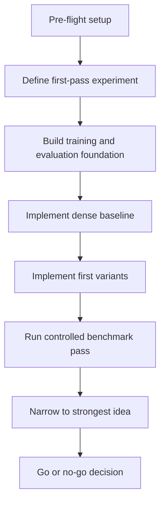
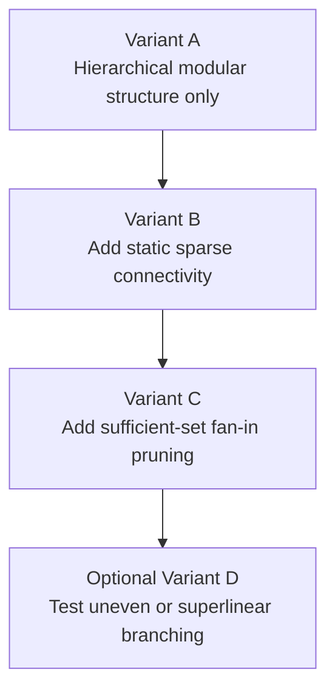

# Prometheus Roadmap

This document explains how the project should move from idea to prototype to decision.

It assumes the research direction has already been described in [PLAN.md](PLAN.md). In plain language, this roadmap is the execution checklist for testing the plan under a constrained first-pass budget.

## Pre-Flight User Setup

This section exists to remove execution friction before any meaningful engineering work begins. For the $5k plan, the fastest path is to frontload account setup, spending controls, access, and public-data readiness.

### Goal

Make it possible to start implementation and pilot runs immediately without blocking on account approvals, missing permissions, or unclear spending authority.

### Actionable Steps

1. Confirm the hard spending cap for the first pass.
2. Confirm which cloud provider will be used first. Google Cloud is the default if already available.
3. Confirm that billing is active on the cloud account.
4. Create or identify a project dedicated to Prometheus experiments.
5. Enable access to GPU-capable compute in that project.
6. Set budget alerts and hard internal spending checkpoints.
7. Confirm whether storage buckets, artifact storage, and logs can be created in that project.
8. Decide how credentials will be provided to the execution environment.
9. Prepare any non-secret identifiers needed for setup, such as project IDs, region preferences, and storage names.
10. Confirm whether public datasets may be downloaded directly from public sources.
11. Confirm whether lightweight paid public datasets are allowed if needed later.
12. Confirm whether training outputs and checkpoints may be stored in cloud storage.

### Recommended Output

The pre-flight phase is complete when there is one approved cloud project, billing is active, GPU access has a realistic path, storage exists for artifacts and checkpoints, budget alerts are configured, credentials have a safe delivery path, and the allowed public data sources are known.

### Copilot Usage Note

For the $5k plan, model-usage budgeting should be treated as an operational constraint, but not the primary one. The practical goal is to avoid wasting context and iteration budget on unnecessary churn.

Recommended practice:

1. Keep project requirements in repository files instead of repeatedly pasting them into chat.
2. Work in checkpoints such as planning, scaffolding, baseline, variants, and evaluation.
3. Avoid dumping large logs unless they are needed for debugging.
4. Start a fresh session after major milestones if context has become noisy.
5. Expect total Copilot usage for the first implementation push to be materially higher than planning-only usage.

The rough usage pattern is simple: planning and roadmap work should be relatively light, initial scaffolding and implementation will be moderate, and a full day of prototype execution with debugging and evaluation will be the heaviest phase.

The exact token count is less important than reducing avoidable rework, repeated file reads, and oversized command output.

### User-Dependent Progress

Progress depends on the user for:

1. Approving the first-pass budget ceiling
2. Providing or authorizing access to the cloud account
3. Providing non-secret environment details such as project IDs and preferred regions
4. Handling any secret credentials directly and securely rather than storing them in the repository
5. Approving whether public datasets can be downloaded automatically
6. Approving whether cloud costs may be incurred immediately for pilot runs

### Security Note

Credentials, API keys, service-account keys, and banking details should not be written into the repository or pasted into project files. They should be handled through secure environment configuration or direct login flows.

### Suggested Decision Gate

Do not begin implementation until cloud access, billing, and credential handling are confirmed.

## Terms Used in This Roadmap

In this document, a baseline is the standard reference model, and a variant is any experimental version that changes one or more architectural features. A pilot run is a short, inexpensive run used to confirm that code, training, and evaluation work before more money is spent. A benchmark suite is the set of tasks and measurements used to compare baseline and variants. An ablation is a controlled comparison where one feature is removed to see whether it really matters. A decision gate is a point where the project should stop and explicitly decide whether to continue. User-dependent progress refers to steps that cannot proceed without user approval, access, or funding decisions.

## High-Level Step Tree
The roadmap moves in a straight line: first remove execution friction, then define the first-pass experiment, then build the foundation needed to run it, then add the smallest architectural changes worth testing, then run the controlled benchmark pass, then narrow to the strongest mechanism, and only then make the investment decision.

## Guiding Principle

The roadmap is designed to answer one question as cheaply and clearly as possible:

Can hierarchical sparse modularity improve capability per parameter or capability per unit compute enough to justify further investment?

This is not a roadmap for building a frontier model immediately. It is a roadmap for producing a disciplined early signal.

For the $5k plan, the first source of failure is usually not model design. It is operational friction. This roadmap therefore starts by eliminating user-side blockers before engineering work begins.

The second source of failure is uncontrolled scope growth. The roadmap is intentionally staged so that the project can stop early if the signal is weak.

## 1. Define the First-Pass Experiment

### Goal

Turn the current research thesis into a narrow experiment that can fail clearly.

This phase exists so the project knows exactly what it is trying to prove before code and cloud spending accelerate.

### Actionable Steps

1. Write down the exact first-pass claim to test.
2. Choose the primary evaluation target.
3. Choose one dense baseline architecture.
4. Choose two or three architectural variants maximum.
5. Choose a parameter budget for the first pass.
6. Choose the training-token budget.
7. Define hard success and failure criteria.
8. Decide what evidence is strong enough to justify a second round.

### Recommended Output

Produce a one-page experiment brief that names the baseline model, the variant set, the datasets, the metrics, the hardware assumptions, the budget cap, and the go or no-go thresholds.

If this output does not exist, later implementation work is much more likely to drift.

### User-Dependent Progress

Progress depends on the user for:

1. Approving the size of the initial financial risk
2. Approving the definition of success for the first pass
3. Deciding whether the goal is primarily scientific validation, investor-grade evidence, or a path to a usable prototype

### Suggested Decision Gate

Do not move forward until the first-pass claim is short enough to fit in two sentences.

## 2. Build the Experimental Foundation

### Goal

Create a minimal, reproducible training and evaluation environment that makes later comparisons trustworthy.

This is the engineering foundation. Its job is to make later experimental results believable.

### Actionable Steps

1. Choose the training framework.
2. Set up repository structure for models, configs, training, and evaluation.
3. Add experiment configuration files.
4. Add logging for loss, throughput, memory use, and evaluation results.
5. Add reproducibility controls such as seeds and fixed config snapshots.
6. Add an evaluation harness that can run baseline and variants consistently.
7. Add a reporting format for side-by-side comparison.

### Recommended Output

Produce a runnable baseline experiment pipeline that can be repeated without manual intervention.

### User-Dependent Progress

Progress depends on the user for:

1. Approving the software stack if there are strong preferences
2. Approving whether cloud compute, rented GPUs, or owned hardware will be used
3. Approving any spending on infrastructure, storage, or hosted training resources

### Suggested Decision Gate

Do not implement novel architecture until the baseline training and evaluation loop works end to end.

## 3. Implement the Dense Baseline

### Goal

Create the reference model that every later claim must beat or match.

### Actionable Steps

1. Implement a clean dense transformer baseline.
2. Match the baseline to the chosen parameter budget.
3. Train a short pilot run to confirm stability.
4. Verify evaluation metrics on held-out tasks.
5. Measure training speed, inference speed, and memory use.
6. Save baseline configs and checkpoints needed for comparison.

### Recommended Output

Produce a stable baseline run with reliable metrics and known cost.

### User-Dependent Progress

Progress depends on the user for:

1. Approving the fairness criteria for baseline comparisons
2. Deciding whether a standard published baseline is sufficient or whether a custom baseline is preferred

### Suggested Decision Gate

If the baseline itself is unstable or too expensive, stop and reduce scope before implementing variants.

## 4. Implement the First Architectural Variants

### Goal

Test the ideas most central to Prometheus without introducing too many moving parts at once.

This phase should be conservative. The purpose is not to express every idea in the plan. The purpose is to test the smallest set of ideas that can produce a meaningful signal.

### Variant Tree

### Actionable Steps

1. Define the unit of modularity.
2. Implement hierarchical grouping of those units.
3. Add a fixed sparse communication topology.
4. Add metrics for active edges, routing cost, and communication budget.
5. Implement one pruning or sparse-fan-in mechanism.
6. Add ablation toggles so each idea can be disabled independently.
7. Keep parameter count and training conditions as close to baseline as possible.

### Recommended Output

Produce a small set of controlled variants whose differences are easy to explain.

### User-Dependent Progress

Progress depends on the user for:

1. Choosing whether uneven branching belongs in the first pass or in a later pass
2. Approving how much architectural complexity is acceptable in version one
3. Deciding how much interpretability matters versus raw benchmark performance

### Suggested Decision Gate

If a variant cannot be explained simply, it is too complex for the first pass.

## 5. Define the Benchmark Suite

### Goal

Measure whether the variants actually improve the properties the project cares about.

This phase answers a simple question: if a model variant looks better, better at what exactly?

### Actionable Steps

1. Choose a language-modeling benchmark.
2. Choose a long-context retrieval benchmark.
3. Choose a routing-heavy or multi-step reasoning benchmark.
4. Define efficiency metrics such as throughput, memory use, and quality under reduced routing budgets.
5. Define robustness checks such as edge dropout or constrained communication.
6. Define how results will be averaged and compared.

### Recommended Output

Produce a benchmark suite that measures both capability and neural efficiency.

### User-Dependent Progress

Progress depends on the user for:

1. Deciding which capabilities matter most for the first signal
2. Deciding whether long-context, reasoning, or efficiency is the top priority
3. Approving the amount of benchmark diversity versus cost discipline

### Suggested Decision Gate

If the benchmark suite does not directly test the core hypothesis, cut it.

## 6. Run the First Controlled Benchmark Pass

### Goal

Generate the first real evidence for or against the architecture.

This is the point where narrative should give way to measured results.

### Actionable Steps

1. Train the dense baseline under the agreed budget.
2. Train each approved variant under the same or closely matched conditions.
3. Record cost, time, memory, and training stability.
4. Run the full benchmark suite.
5. Compare quality against compute and communication cost.
6. Inspect whether sparse variants degrade more gracefully under tighter budgets.
7. Summarize the results in a short internal report.

### Recommended Output

Produce a comparison table that clearly shows where each variant wins, loses, or is inconclusive.

### User-Dependent Progress

Progress depends on the user for:

1. Approving the final spend for the benchmark run
2. Deciding whether inconclusive results justify another pass
3. Deciding whether a narrow win is enough to continue

### Suggested Decision Gate

Do not rely on intuition after this point. Continue only if the numbers justify it.

## 7. Narrow to the Strongest Idea

### Goal

Prevent the project from drifting into a bundle of loosely related ideas.

This phase matters because research projects often fail by refusing to simplify after the first round of evidence.

### Actionable Steps

1. Rank variants by signal strength.
2. Kill variants that add complexity without clear gain.
3. Identify whether the best signal comes from topology, pruning, or branching.
4. Run one or two focused follow-up ablations on the strongest component.
5. Check whether the result survives a modest increase in model size or training budget.

### Recommended Output

Produce a second-round recommendation focused on one main mechanism.

### User-Dependent Progress

Progress depends on the user for:

1. Approving the discipline to abandon favored ideas if they do not work
2. Choosing whether to optimize for publishable evidence, product relevance, or long-term architectural promise

### Suggested Decision Gate

If the project cannot name the strongest mechanism, it is not ready to scale.

## 8. Make the Go or No-Go Decision

### Goal

Decide whether Prometheus has earned more money, more time, and more complexity.

This is a formal decision phase, not just a summary. The project should either earn another round or deliberately stop, simplify, or pivot.

### Actionable Steps

1. Compare the observed gains against the predefined thresholds.
2. Estimate whether the strongest result is likely to scale.
3. Estimate the cost of the next round.
4. Decide whether to continue, simplify, pivot, or stop.
5. Capture the reasoning in a short written decision memo.

### Recommended Output

Produce a clear decision memo that lands on one of four outcomes: continue with focused iteration, continue with a larger budget, simplify and retest, or stop the current direction.

### User-Dependent Progress

Progress depends on the user for:

1. Approving further capital allocation
2. Deciding what level of evidence is required before scaling investment
3. Deciding whether strategic patience or rapid iteration is the better posture

### Suggested Decision Gate

No second-round spending should happen without a written decision memo tied to measured results.

## Cross-Cutting User Dependencies

Some decisions affect every phase. The most important are the total first-pass budget, the preferred speed-versus-rigor tradeoff, tolerance for inconclusive outcomes, willingness to abandon biologically appealing ideas that do not produce measurable value, the intended success mode of the project, the speed and safety of cloud access, whether public data can be used without extra review, and how aggressively Copilot usage should be optimized for speed versus context discipline.

## Immediate Next Actions

1. Confirm the cloud project, billing status, and GPU access path.
2. Confirm how credentials and non-secret environment details will be provided securely.
3. Confirm the $5k cap and the first internal spending checkpoint.
4. Confirm whether approved public datasets can be downloaded directly.
5. Lock the first-pass claim in two sentences.
6. Decide the exact parameter and token budget.
7. Decide the baseline and maximum number of variants.
8. Decide the benchmark suite.
9. Decide the hard go or no-go threshold for spending beyond the first pass.